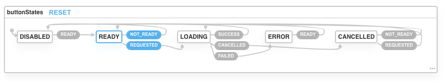

# State Machines with XState

[Garden Blog Post](https://johndavidfrancis.com/state-machines-in-react)

[See Live Demo](https://johndavidfrancis.com/sandbox/state-machines)

[See Code](./StateMachinesApp.js)

In this sandbox experiment, I played around with using Formik and XState to manage button and form state.
I liked the simplicity of both tools once they get wired up, but the wiring between them feels clunky and like it would be poor performance.
I might need to mess with the example more to determine how to make it more performant.

# Findings

## Consensus

I'm getting really warm to the idea of using state machines for UI components. It's a really valuable and promising concept and XState does a fine job executing it.
It's not the most elegant code implementation, imo, but its perfectly fine and its not is really a turnoff for myself; and I don't foresee it being a turnoff for others either. 
The code it has you write is very intuitive and the concept seems easy enough to grasp that I could easy train other devs in.
However, due to some clunky interactions with form state and disappointment with the visualization tool,
I wouldn't consider using it everywhere just yet.
I still need to think/experiment with solutions for those last two clunky issues and then it would be perfect
and it might become my de-facto standard for writing UI components.

My example, visualized:

## The Good

- Super clean and readable button code
- Very obvious and easy if I wanted to abstract the button component, but still have the parent control the button states.
- If I were to abstract the button component it would be suuuper easy to mock up button states in a storybook knobs example for designers to play around with. That idea is quite exciting
- If the viz tool was better, I could see making a more live example than even just passing the state in as a string and instead using the traversable state machine visualizer.
- Programmatic concepts can get way deeper even than my example, but can be easily explained.
- Could unlock some super dope graph concepts (aka, shortest )

## The Bad

- In order to have the button state react to form state, I had to update the button state inside of a hook which doubled the number of re-renders. Although this is isn't any different had I not been doing re-renders.
- I was really tempted to performance optimize by not sending events that I know won't do anything in the current state but this would just be duplicating the state machine logic.

## The Ugly

- Since I want to trigger state changes on form ready and error states,
  I have to send a form complete/incomplete event just within a hook.
  I might be missing something but there doesn't seem to be a good way to tie
  into the form other than just using a useEffect hook.
- Plugging the state machine data into the visualizer tool was quite literally just ugly.
  Hard to read since everything is pretty much in a straight line.
  I wish there was a prettier display =/
  This worries me since this is a pretty straightforward example with only 5 states.
  I can't even imagine how messy this would be
- The visualizer is not able to be used as a package, so at the moment I wouldn't be able to turn this into some sort
  of living documentation as I hoped.
- XState Syntax
  - I don't really like the idea of needing an ID for my state machine, this seems like a completely unnecessary implementation detail?
    Perhaps its just unnecessary for singular state machines like this and it would come into play for layered state machines.
    Either way it feels like it should be optional for my example.
  - The "on" keyword is a little weird but I see why he wrote it like that
